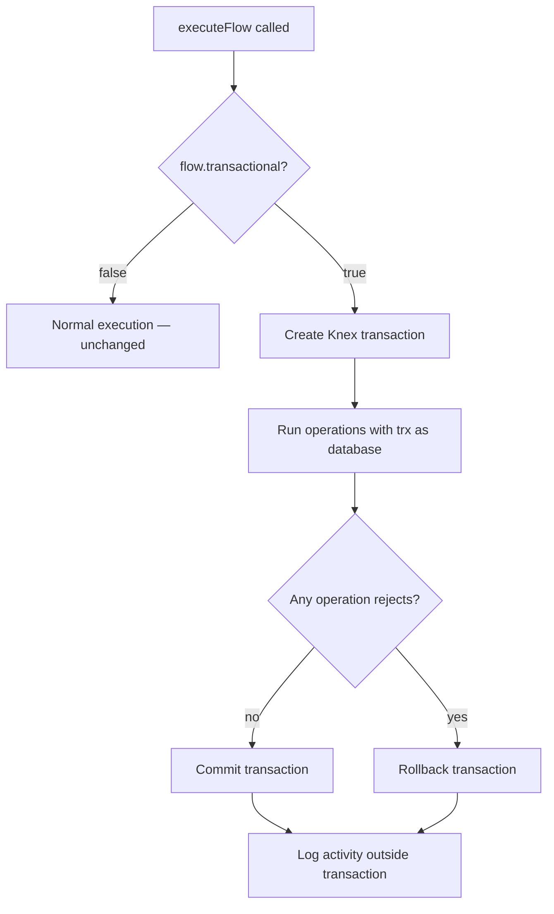

# Transactional Flows — Walkthrough

## What Changed

Added a **Transactional Mode** toggle to Directus flows. When enabled, all operations in a flow run inside a single Knex database transaction. If any operation rejects, the entire transaction rolls back — no partial writes.

## Files Modified

| File | Change |
|------|--------|
| [20260311A-add-flow-transactional.ts](file:///Users/Sadman/Documents/GitHub/directus-fork/directus/api/src/database/migrations/20260311A-add-flow-transactional.ts) | **[NEW]** Migration adds `transactional` boolean column (default `false`) to `directus_flows` |
| [flows.ts](file:///Users/Sadman/Documents/GitHub/directus-fork/directus/packages/types/src/flows.ts) | Added `transactional: boolean` to [Flow](file:///Users/Sadman/Documents/GitHub/directus-fork/directus/packages/types/src/flows.ts#5-17) and [FlowRaw](file:///Users/Sadman/Documents/GitHub/directus-fork/directus/packages/types/src/flows.ts#30-46) interfaces |
| [flows.yaml](file:///Users/Sadman/Documents/GitHub/directus-fork/directus/packages/system-data/src/fields/flows.yaml) | Registered `transactional` field with `cast-boolean` special |
| [flows.ts](file:///Users/Sadman/Documents/GitHub/directus-fork/directus/api/src/flows.ts) | Added [executeTransactionalFlow()](file:///Users/Sadman/Documents/GitHub/directus-fork/directus/api/src/flows.ts#491-638) method — wraps operations in `database.transaction()`, passes `trx` as context, rolls back on reject |
| [flow-drawer.vue](file:///Users/Sadman/Documents/GitHub/directus-fork/directus/app/src/modules/settings/routes/flows/flow-drawer.vue) | Added transactional toggle in Flow Setup tab |
| [en-US.yaml](file:///Users/Sadman/Documents/GitHub/directus-fork/directus/app/src/lang/translations/en-US.yaml) | Added 3 i18n keys for the toggle labels |

## How It Works

## Fork Separation

All changes are **additive** and gated by the `transactional` boolean:
- Default is `false` — existing flows behave identically
- New method [executeTransactionalFlow()](file:///Users/Sadman/Documents/GitHub/directus-fork/directus/api/src/flows.ts#491-638) is a separate code path
- No existing logic was modified, only an early-return guard added at line 387

## Verification

| Check | Result |
|-------|--------|
| `@directus/types` build | ✅ Clean |
| `@directus/types` dist includes `transactional` | ✅ Both interfaces |
| API `tsc --noEmit` | ✅ No new errors (6 pre-existing in unrelated AI chat test) |

## Manual Testing Steps

1. Restart the API dev server — migration runs automatically
2. Go to **Settings → Flows → Create New Flow**
3. In the **Flow Setup** tab, set **Transactional Mode** to Enabled
4. Add operations and test that rollback works when an operation fails
